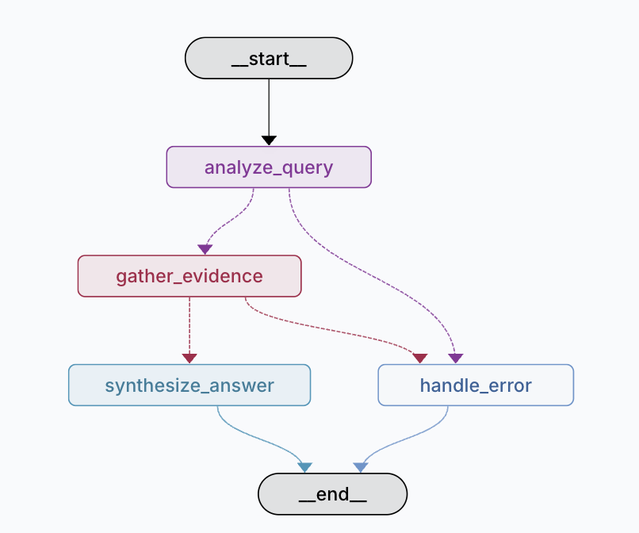

# AI Research Concierge

Agent de recherche LangGraph inspiré du repo [Open Deep Research](https://github.com/langchain-ai/open_deep_research).

## Capacités

- **Analyse de questions** : Décompose les questions complexes en sous-questions recherchables
- **Recherche web** : Utilise l'API Tavily pour des recherches en temps réel
- **Base de connaissances locale** : Fallback vers une KB locale pour les tests
- **Synthèse structurée** : Génère des réponses formatées avec résumé exécutif et détails

## Installation

**Pre-requisites**

- Python 3.12
- [uv](https://docs.astral.sh/uv/): `brew install uv`

**Repo setup**

```bash
git clone git@github.com:arthurlemon/ai-research-concierge.git

uv venv

source .venv/bin/activate

uv sync --all-groups
```

## Configuration

### Clés API requises

```bash
# OpenAI (requis pour les LLM)
export OPENAI_API_KEY=...

# Tavily (optionnel, pour recherche web: https://www.tavily.com/)
export TAVILY_API_KEY=votre_cle_ici
```

**Note** : Si `TAVILY_API_KEY` n'est pas configurée, l'agent utilisera automatiquement la base de connaissances locale.

## Utilisation

### Option 1 : CLI Python

La façon la plus simple de tester l'agent :

```bash
uv run python -m docmana.run
```

Tapez votre question et appuyez sur Entrée.

### Option 2 : LangGraph Studio

Pour visualiser le flow et déboguer :

```bash
uvx --refresh --from "langgraph-cli[inmem]" --with-editable . --python 3.12 langgraph dev
```

Ouvrez ensuite : <https://smith.langchain.com/studio/?baseUrl=http://127.0.0.1:2024>

### Option 3 : API REST (FastAPI)

Démarrez le serveur API :

```bash
uv run uvicorn docmana.api:api --reload
```

Le serveur démarre sur `http://localhost:8000`. Consultez la documentation interactive à `http://localhost:8000/docs`.

**Exemple de requête** :

```bash
curl -X POST "http://localhost:8000/research" \
  -H "Content-Type: application/json" \
  -d '{
    "query": "Quelles sont les meilleures pratiques pour sécuriser une API REST ?",
    "model": "openai:gpt-4.1",
    "max_tokens": 10000
  }'
```

## Architecture



### Nœuds

| Nœud | Description | Outils utilisés |
|------|-------------|-----------------|
| **analyze_query** | Analyse la question et la décompose si nécessaire | LLM avec structured output |
| **gather_evidence** | Recherche des informations pour chaque sous-question | `tavily_search` (prioritaire) puis `knowledge_lookup` (fallback) |
| **synthesize_answer** | Combine les résultats en rapport structuré | LLM
| **handle_error** | Gère les erreurs et propose des clarifications | LLM

### Outils de recherche

#### 1. Tavily Search (Prioritaire)

Recherche web en temps réel via l'API Tavily. Utilisé automatiquement si `TAVILY_API_KEY` est configurée.

**Caractéristiques** :

- Recherche sur le web ouvert
- Résultats récents et pertinents
- Timeout de 30 secondes
- Retourne max 5 résultats par requête

#### 2. Knowledge Lookup (Fallback)

Base de connaissances locale en mémoire pour tests et démonstrations.

**Sujets couverts** :

- Comparaison Python vs JavaScript backend
- Tendances cybersécurité pour PME
- Modèles open source vs propriétaires

## Personnalisation

### Ajouter votre propre outil

Éditez `src/docmana/tools.py` :

```python
@tool
async def mon_outil(query: str) -> str:
    """Description de votre outil."""
    # Votre logique ici
    return resultat
```

Puis importez-le dans `graph.py` et utilisez-le dans `gather_evidence()`.

### Modifier les prompts

Les prompts sont dans `src/docmana/prompts.py`. Modifiez-les pour ajuster :

- Le style de décomposition des questions
- Le format de synthèse
- Le ton des réponses

### Run les tests

```
uv run pytest
```
